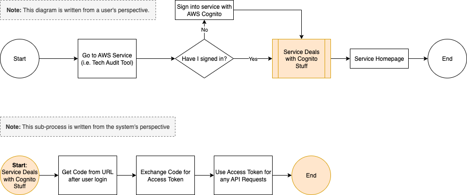
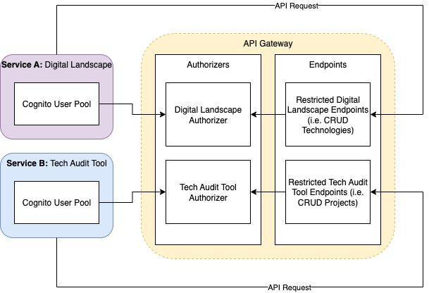

# Security

## Web Application Firewall (WAF)

The API Gateway sits behind a Web Application Firewall (WAF) to filter access based on IP address. A major aspect of our API is that developers can use the deployed API when running our services locally. This means that the API must have internet access to meet this requirement, while also maintaining security.

Within the project, a firewall is associated with API Gateway. This means that any requests to the API Gateway are inspected and filtered by the WAF before reaching the backend services. The WAF is configured to block all requests by default, and only allow requests from specific IP addresses. This is done by creating an IP Set that contains the allowed IP addresses, which are typically the developer's MacBook IPs.

In order for developers to access the API on their local machine, they must add their IP address to the IP set, and remove it when they are done. This will ensure that only authorized IP addresses can access the API, while still allowing developers to work on their local machines.

A further development which should be made when creating the production API is a more dynamic way of managing the IP set, for example flushing the list every 12 hours similar to Concourse's approach.

## AWS Cognito Integration

AWS Cognito is used for authentication and authorisation within our API. Most of our services integrate with AWS Cognito already to manage user access, making this a suitable approach since the user pool infrastructure is already in place.

Cognito integration works by assigning API Gateway Authorizers to the API methods that require authentication. Each authorizer is then configured to depend on a certain user pool (in the project API's case, this will be the pool from the respective service). This will limit which services can access what parts of the API.

To authenticate with Cognito when making requests, each service must simply pass the access token generated by Cognito in the Authorisation header. When a user logs into Cognito, they receive a code which can then be exchanged for an access token. Below is a diagram illustrating this process.

### Downfalls in this Approach

This approach does have a downfall, being that it relies heavily on AWS Cognito. If the API needs to be called using a service without existing cognito integration, the endpoint will need to be unrestricted. This has a side effect where non-restricted endpoints could be called by any service, potentially leading to security vulnerabilities.

In our production API and final implementation, we will need to address this by either adding additional security (i.e. resource policies) or migrating away from AWS Cognito (i.e. use IAM authentication instead).

### How this Might Scale (Production API Example)

In a production API, the Cognito integration would be expanded to include multiple user pools, each associated with a different service. This would then mean that endpoints for each service would need to be configured to use the appropriate user pool for authentication.

See the below diagram for a visual representation of the integration.

## Alternative/Additional Authentication Methods (Not Implemented in PoC)

### Resource Policies

Resource Policies allow you to allow or deny traffic to endpoints based on the source of the request. This can be useful for limiting access to certain IP addresses, AWS accounts, or VPC endpoints.

In terms of our current infrastructure, I don't think we can easily adopt this. All of our services reside within the same VPC, so we don't have the granularity of control that resource policies would provide.

### AWS IAM

IAM authentication works similarly to AWS Cognito, but instead of using user pools, it relies on IAM users and roles for authentication. 

This method would involve creating an IAM user for each service that needs to access the API, and then granting that user the necessary permissions to call the API endpoints. On the service side of things, the service would need to include the IAM user's access key and secret access key in the request to the API.

This would allow us complete control over which services can access the API and what endpoints are available. Since secret keys are used - nothing user provided - this approach can be applied to all services.

### Custom Lambda Authentication

Custom Lambda authentication allows you to create your own authentication logic using AWS Lambda functions. This can be useful for implementing custom authentication mechanisms that are not supported by AWS Cognito or IAM.

I believe this scenario is no use to us as it adds unnecessary complexity to our architecture, alongside additional maintenance overhead.
